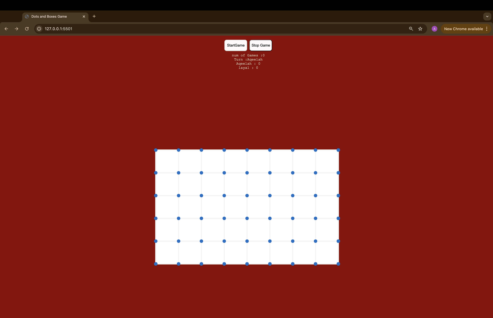

# Dots&Boxes

Welcome to **Dots&Boxes**,
I created this game because I was inspired by The Matrix series and wanted to bring its world to life through a fun game.

## Features
- **multiple Grid size and custom option**:  5x5 , 10x10, 15x15, custom by entering the rows and columns
- **Change the color of the dots based on the player option**: use the dropdown option to change the color of the dots.
- **Multiple modes to play** : PxC, PxP,2PxC, and Px2C. 

## Click the link below to start playing Dots&Boxes Game: 

- https://aqeelaalghasra.github.io/GA-Project-1/GA-Project1-Dots-and-Boxes/index[https://aqeelaalghasra.github.io/GA-Project-1/GA-Project1-Dots-and-Boxes/index]

## How to Play
- create boxes majority of boxes to win the game when the board is completed and full of boxes the game ends.

## How to start the game 
1. **choose board size** 
2. **choose game mode** 
3. **Fill your name** 
4. **choose the dots color** 
5. **Click the start button to start the game**
6. **Click the stop button to stop the game** 

## Technologies Used
- **HTML5**: building the layout of the game page 
- **CSS3**: styling and identifying the board elements 
- **JavaScript & Jquesry**: Game board building and game logic and Computer selection methods 

## Game View

## Next Steps: 
- updating the playing methods   
- adding more customization for square color per player 
- add better them
